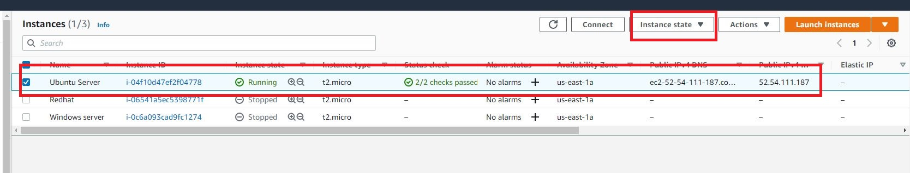
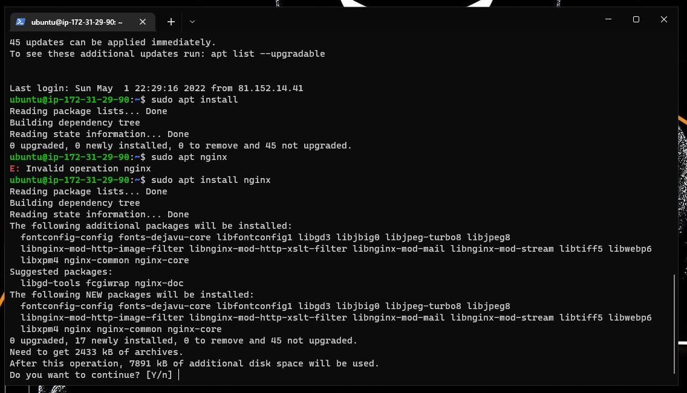
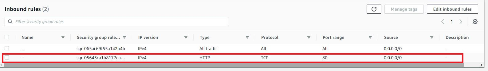
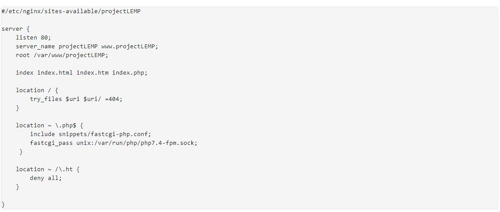
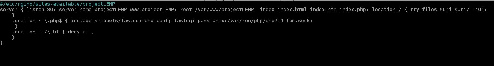
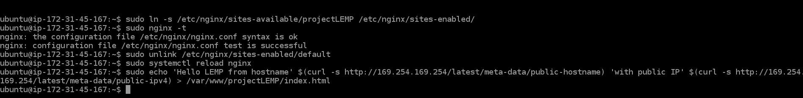
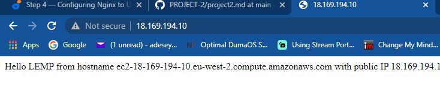

### 
INSTALLING NIGINX WEB SERVER  

In this project I would be implementing a similar stack like Apache but with NGINX Webserver.

In order to begin this project the following is required ;

<ol>
  <li>AWS account</li>
  <li>EC2 instance of t2.nano running Ubuntu Server 20.04 LTS (HVM) image</li>
  <li>Git Bash</li> 
  </ol>

Lets begin:-

In order to display web pages for visitors to view my website, I'm going to deploy Ngnix. Its a high performance web server.

Login to AWS management console, open EC2 then launch instance if you haven't created one (Ubuntu Server).

 

 First I'm going to update the server package index by running the command 
 
 <code>sudo apt update</code> then <code>sudo apt install nginx</code> to install Nginx Web server, type Y for yes to install the application.

  

This is installed on the Ubuntu 20.04 server(Instance), to verify nginx is running correctly then run the command 

<code>sudo systemctl status nginx</code>

  To allow server to receive traffic by the Web server, I will need to open TCP port 80 which is the default port browsers use to access web page on the internet. 

  We currently have TCP port 22 open by default on the EC2 machine to access it via SSH, a new rule will be needed open inbound connection through port 80: Which was created in previous project(project-1) 

  

Next that a firewall has been configured with TCP port 80 open, test Nginx Server can respond to request from the internet.

Open a browser and type in public IP address into the URL 

 

### 
INSTALLING MYSQL

When using the Nginx web server, we can create server blocks (similar to virtual hosts in Apache) to encapsulate configuration details and host more than one domain on a single server. In this project , I will be using projectLEMP as an example domain name.

On Ubuntu 20.04, Nginx has one server block enabled by default and is configured to serve documents out of a directory at /var/www/html. While this works well for a single site, it can become difficult to manage if you are hosting multiple sites. Instead of modifying /var/www/html, we’ll create a directory structure within /var/www for the your_domain website, leaving /var/www/html in place as the default directory to be served if a client request does not match any other sites.

Create the root web directory for your_domain as follows:

<code>sudo mkdir /var/www/projectLEMP</code>

Next, assign ownership of the directory with the $USER environment variable, which will reference your current system user:

<code>sudo chown -R $USER:$USER /var/www/projectLEMP</code>

Then, open a new configuration file in Nginx’s sites-available directory using your preferred command-line editor. Here, we’ll use nano:

<code>sudo nano /etc/nginx/sites-available/projectLEMP</code>

This will create a new blank file. Paste in the following bare-bones configuration:

Nano Command line editor

Activate your configuration by linking to the config file from Nginx’s sites-enabled directory:

<code>sudo ln -s /etc/nginx/sites-available/projectLEMP /etc/nginx/sites-enabled/</code>

This will tell Nginx to use the configuration next time it is reloaded. You can test your configuration for syntax errors by typing:

<code>sudo nginx -t</code>

Also need to disable default Nginx host that is currently configured to listen on port 80, for this run:

<code>sudo unlink /etc/nginx/sites-enabled/default</code>

Now, reload Nginx to apply the changes:

<code>sudo systemctl reload nginx </code>

The new website is now active, but the web root /var/www/projectLEMP is still empty. Create an index.html file in that location so that we can test that your new server block works as expected:

<code>sudo echo 'Hello LEMP from hostname' $(curl -s http://169.254.169.254/latest/meta-data/public-hostname) 'with public IP' $(curl -s http://169.254.169.254/latest/meta-data/public-ipv4) > /var/www/projectLEMP/index.html</code>

Now open a browser and try to open your website URL using IP address:

<code>http://18.169.194.10:80</code>

This means the 'echo' command I wrote to index.html, this confirms Nginx site is working as expected.

LEMP stack is now fully configured. In the next step, we’ll create a PHP script to test that Nginx is able to manage .php files within the newly configured website.

