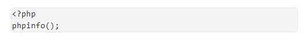
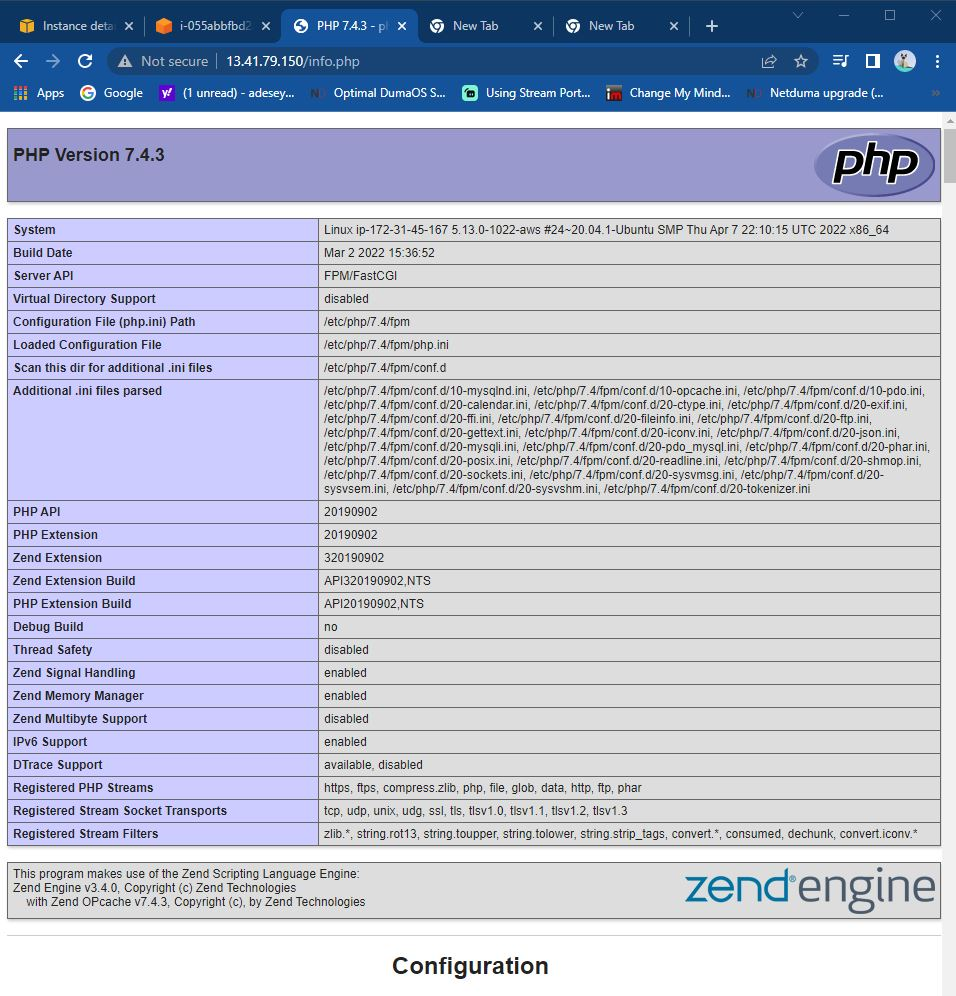
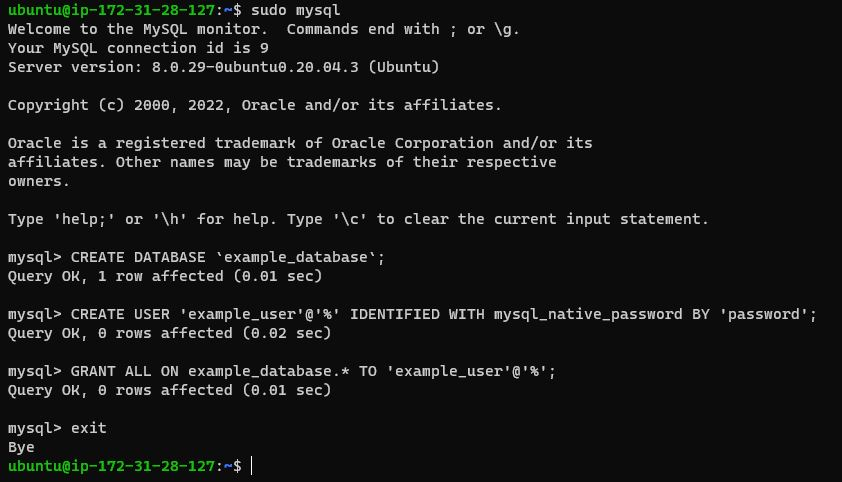
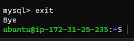
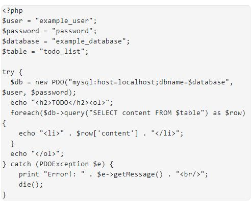

 ### DOCUMENTATION OF PROJECT-2 LEMP STACK IMPLEMENTATION

### 
INSTALLING NIGINX WEB SERVER 
 

In this project I would be implementing a similar stack like Apache but with NGINX Webserver.

In order to begin this project the following is required ;

<ol>
  <li>AWS account</li>
  <li>EC2 instance of t2.nano running Ubuntu Server 20.04 LTS (HVM) image</li>
  <li>Git Bash but I will be using Terminal</li> 
  </ol>

Lets begin:-

In order to display web pages for visitors to view my website, I'm going to deploy Ngnix. Its a high performance web server.

Login to AWS management console, open EC2 then launch instance if you haven't created one (Ubuntu Server).

 

 First I'm going to update the server package index by running the command 
 
 <code>sudo apt update</code> then <code>sudo apt install nginx</code> to install Nginx Web server, type Y for yes to install the application.

  

This is installed on the Ubuntu 20.04 server(Instance), to verify nginx is running correctly then run the command 

<code>sudo systemctl status nginx</code>

  To allow server to receive traffic by the Web server, I will need to open TCP port 80 which is the default port browsers use to access web page on the internet. 

  We currently have TCP port 22 open by default on the EC2 machine to access it via SSH, a new rule will be needed open inbound connection through port 80: Which was created in previous project(project-1) 

  

Next that a firewall has been configured with TCP port 80 open, test Nginx Server can respond to request from the internet.

Open a browser and type in public IP address into the URL 

 

## 
INSTALLING MYSQL

Now that Apache web server is up and running, now am going to install MySQL server which is a Database Management System (DBMS). This will store and manage data on my website.

On Terminal run the command to install MySQL

<code>sudo apt install MySQL-server</code> and type Yes

Type Y for yes and hit the enter key install MySQL.

Once Mysql has been installed its recommended you run this command in a production live environment.

<code>sudo mysql_secure_installation</code>

You would be prompted to validate a password plugin, enabling a password for Mysql and this also removes default configurations that comes pre-installed such as:

Removes anonymous users

Disables root login remotely

Removes data base named 'test' intended for testing which shouldn't be allowed in production environment and more...

For this project we will be using the default configuration as its a test project environment 

### 
INSTALLING PHP

 I have successfully installed Nginx to server my content and MySQL installed to store and manage data. Now I need to install PHP to process code and generate dynamic content for the webserver.

 I will need to install 2 packages at once, run :

 <code>sudo apt install php-fpm php-mysql</code>

When prompted, type Y and press ENTER to confirm installation.

You now have your PHP components installed. Next, you will configure Nginx to use them.

### 
CONFIGURING NGINX TO USE PHP PROCESSOR

When using the Nginx web server, we can create server blocks (similar to virtual hosts in Apache) to encapsulate configuration details and host more than one domain on a single server. In this project , I will be using projectLEMP as an example domain name.

On Ubuntu 20.04, Nginx has one server block enabled by default and is configured to serve documents out of a directory at /var/www/html. While this works well for a single site, it can become difficult to manage if you are hosting multiple sites. Instead of modifying /var/www/html, we’ll create a directory structure within /var/www for the your_domain website, leaving /var/www/html in place as the default directory to be served if a client request does not match any other sites.

Create the root web directory for your_domain as follows:

<code>sudo mkdir /var/www/projectLEMP</code>

Next, assign ownership of the directory with the $USER environment variable, which will reference your current system user:

<code>sudo chown -R $USER:$USER /var/www/projectLEMP</code>

Then, open a new configuration file in Nginx’s sites-available directory using your preferred command-line editor. Here, we’ll use nano:

<code>sudo nano /etc/nginx/sites-available/projectLEMP</code>

This will create a new blank file. Paste in the following bare-bones configuration:

Nano Command line editor

Activate your configuration by linking to the config file from Nginx’s sites-enabled directory:

<code>sudo ln -s /etc/nginx/sites-available/projectLEMP /etc/nginx/sites-enabled/</code>

This will tell Nginx to use the configuration next time it is reloaded. You can test your configuration for syntax errors by typing:

<code>sudo nginx -t</code>

Also need to disable default Nginx host that is currently configured to listen on port 80, for this run:

<code>sudo unlink /etc/nginx/sites-enabled/default</code>

Now, reload Nginx to apply the changes:

<code>sudo systemctl reload nginx </code>

The new website is now active, but the web root /var/www/projectLEMP is still empty. Create an index.html file in that location so that we can test that your new server block works as expected:

<code>sudo echo 'Hello LEMP from hostname' $(curl -s http://169.254.169.254/latest/meta-data/public-hostname) 'with public IP' $(curl -s http://169.254.169.254/latest/meta-data/public-ipv4) > /var/www/projectLEMP/index.html</code>

Now open a browser and try to open your website URL using IP address:

<code>http://18.169.194.10:80</code>

This means the 'echo' command I wrote to index.html, this confirms Nginx site is working as expected.

LEMP stack is now fully configured. In the next step, we’ll create a PHP script to test that Nginx is able to manage .php files within the newly configured website.

   ### 
TESTING PHP WITH NGINX

 I currently have LEMP stack completely setup, to validate Nginx can correctly hand .php files to my setup PHP processor.

This can be done by creating a test PHP file in my document root. Open a new file called info.php within your document root in your text editor:

<code>sudo nano /var/www/projectLEMP/info.php</code>

Type or paste the following lines into the new file. This is valid PHP code that will return information about your server:

*Hold Ctrl + U to paste code into editor, then Ctrl X key to save and exit editor*

You can now access this page in your web browser by visiting the domain name or public IP address you’ve set up in your Nginx configuration file, followed by /info.php:

<code>http://13.41.79.150/info.php</code>

You will see a web page containing detailed information about your server: 

This validates NGIX handles .php files off my OHP processor, I'm going to remove the file you I created has it contains sensitive information about my PHP environment and my Ubuntu server. 

Now use rm to remove that file:

<code>sudo rm /var/www/your_domain/info.php</code>  

This can be retrieved at a later time when needed.

 ## RETRIEVING DATA FROM MYSQL DATABASE WITH PHP 

 In this step you will create a test database (DB) with simple "To do list" and configure access to it, so the Nginx website would be able to query data from the DB and display it.

At the time of this writing, the native MySQL PHP library mysqlnd doesn’t support caching_sha2_authentication, the default authentication method for MySQL 8. We’ll need to create a new user with the mysql_native_password authentication method in order to be able to connect to the MySQL database from PHP.

We will create a database named example_database and a user named example_user, but you can replace these names with different values.

First, connect to the MySQL console using the root account:

<code>sudo mysql</code>

To create a new database, run the following command from your MySQL console:

<code>mysql> CREATE DATABASE `example_database`;</code>

Now you can create a new user and grant him full privileges on the database you have just created.

The following command creates a new user named example_user, using mysql_native_password as default authentication method. We’re defining this user’s password as password, but you should replace this value with a secure password of your own choosing.

<code>mysql>  CREATE USER 'example_user'@'%' IDENTIFIED WITH mysql_native_password BY 'password';</code>

Now we need to give this user permission over the example_database database:

<code>mysql> GRANT ALL ON example_database.* TO 'example_user'@'%';</code>

This will give the example_user user full privileges over the example_database database, while preventing this user from creating or modifying other databases on your server.

Now exit the MySQL shell with:

<code>mysql> exit</code>

Now I can test if the new user has the proper permissions by logging in to the MySQL console again, this time using the custom user credentials:

<code>mysql -u example_user -p</code>

Notice the -p flag in this command, which will prompt you for the password used when creating the example_user user. After logging in to the MySQL console, confirm that you have access to the example_database database:

<code>mysql> SHOW DATABASES;</code>

This will give you the following output:

Next, we’ll create a test table named todo_list. From the MySQL console, run the following statement:

Insert a row of content into the test table. 

To confirm that the data was successfully saved to your table, run:

<code>mysql>  SELECT * FROM example_database.todo_list;</code>

After confirming that you have valid data in your test table, you can exit the MySQL console:

<code>mysql> exit</code>

Now I can create a PHP script that will connect to MySQL and query for your content. Create a new PHP file in your custom web root directory using your preferred editor. We’ll use vi for that:

The following PHP script connects to the MySQL database and queries for the content of the todo_list table, displays the results in a list. If there is a problem with the database connection, it will throw an exception.

Copy this content into your todo_list.php script:

<code>vi /var/www/projectLEMP/todo_list.php</code>

Save and close the file when you are done editing.

You can now access this page in your web browser by visiting the domain name or public IP address configured for your website, followed by /todo_list.php:

<code>http://18.170.219.197/todo_list.php</code>

I have successfully installed and configured Nginx as a web server, PHP for website and MySQL as database management system.  