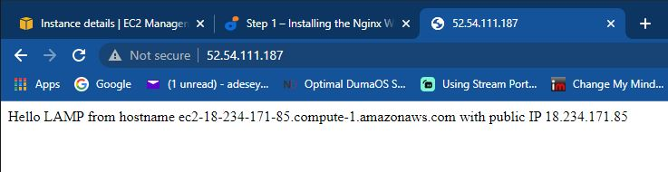

### 
INSTALLING Nginx Web Server 

In this project I would be implementing a similar stack like Apache but with NGINX Webserver.

In order to begin this project the following is required ;

<ol>
  <li>AWS account</li>
  <li>EC2 instance of t2.nano running Ubuntu Server 20.04 LTS (HVM) image</li>
  <li>Git Bash</li> 
  </ol>

Lets begin:-

In order to display web pages for visitors to view my website, I'm going to deploy Ngnix. Its a high performance web server.

Login to AWS management console, open EC2 then launch instance if you haven't created one (Ubuntu Server).

 

 First I'm going to update the server package index by running the command 
 
 <code>sudo apt update</code> then <code>sudo apt install nginx</code> to install Nginx Web server, type Y for yes to install the application.

  

This is installed on the Ubuntu 20.04 server(Instance), to verify nginx is running correctly then run the command <code>sudo systemctl status nginx</code>

  

  To allow server to receive traffic by the Web server, I will need to open TCP port 80 which is the default port browsers use to access web page on the internet. 

  We currently have TCP port 22 open by default on the EC2 machine to access it via SSH, a new rule will be needed open inbound connection through port 80: Which was created in previous project(project-1) 

  

  First I' going to attempt to access Ubuntu shell locally by running  

<code>curl http://localhost:80 </code>
                
                or

<code>curl http://127.0.0.1:80</code>

Yes I can.

Next is to test if the Nginx Server can respond to request from the internet, open a browser and type in public IP address into the URL 

<code>http://http://52.54.111.187/80</code>

 

